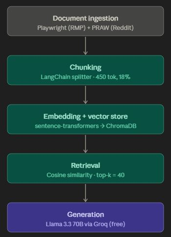

# Project 1 Planning: The Unofficial Guide

> Write this document before you write any pipeline code.
> Your spec and architecture diagram are what you'll use to direct AI tools (Claude, Copilot, etc.) to generate your implementation — the more specific they are, the more useful the generated code will be.
> Update the Retrieval Approach and Chunking Strategy sections if you change your approach during implementation.
> Update this file before starting any stretch features.

---

## Domain

<!-- What domain did you choose? Why is this knowledge valuable and hard to find through official channels? -->
I choose a domain that goes over rate my professor reviews on the Computer Science Department at my university(University of Houston-Downtown). This knowledge is valulable because it gives students the option to look over professors overall personality,workload for many courses. Its really not hard to find reviews for each professor, but there are times where some reviews might be outdated or not enough reviews are posted for some professors.
---

## Documents

<!-- List your specific sources: URLs, subreddit names, forum threads, or file descriptions.
     Aim for at least 10 sources that together cover different subtopics or perspectives within your domain. -->

| # | Source | Description | URL or location |
|---|--------|-------------|-----------------|
| 1 | | | |   Kamto:       https://www.ratemyprofessors.com/professor/2633588
| 2 | | | |   Yilamaz:     https://www.ratemyprofessors.com/professor/2690400
| 3 | | | |   Pakhrin:     https://www.ratemyprofessors.com/professor/2889570
| 4 | | | |   Harris:      https://www.ratemyprofessors.com/professor/2051130
| 5 | | | |   Xu:          https://www.ratemyprofessors.com/professor/2179343
| 6 | | | |   Lin:         https://www.ratemyprofessors.com/professor/173959
| 7 | | | |   Zhang:       https://www.ratemyprofessors.com/professor/2361808
| 8 | | | |   Izadi:       https://www.ratemyprofessors.com/professor/2918727
| 9 | | | |   Yuan:        https://www.ratemyprofessors.com/professor/549688
| 10 | | | |  Reddit       https://www.reddit.com/r/uhd/comments/18de5n2/cs_classes_prof_info_please/

---

## Chunking Strategy

<!-- How will you split documents into chunks?
     State your chunk size (in tokens or characters), overlap size, and explain why those
     numbers fit the structure of your documents.
     A review-heavy corpus warrants different chunking than a long FAQ. -->

**Chunk size:**
 250 Tokens
**Overlap:**
18%

**Reasoning:**
Balances out the structure and perveres the broader context for each professor

---

## Retrieval Approach

<!-- Which embedding model are you using (e.g., all-MiniLM-L6-v2 via sentence-transformers)?
     How many chunks will you retrieve per query (top-k)?
     If you were deploying this for real users and cost wasn't a constraint, what tradeoffs
     would you weigh in choosing a different embedding model — context length, multilingual
     support, accuracy on domain-specific text, latency? -->

**Embedding model:**
sentence-transformers

**Top-k:**
40

**Production tradeoff reflection:**
Latency, multillingual
---

## Evaluation Plan

<!-- List your 5 test questions with their expected correct answers.
     Questions should be specific enough that you can judge whether the system's response
     is right or wrong. "What are good dining halls?" is too vague.
     "What do students say about wait times at [dining hall name] during lunch?" is testable. -->

| # | Question | Expected answer |
|---|----------|-----------------|
| 1 | | Which professors (top3) quizzes, assignments are most aligned to tests, final exam? |Xu, Yilamaz, Harris
| 2 | | Which professors (top3) is the most lenient for assignement late due dates? | Xu, Yilanaz, Zhang
| 3 | | What professors (top 3) do students pefer for taking Elective classes? |Xu, 
| 4 | | What do students say there worst experience is for each professor? | Unfair Grading, misunderstood due dates
| 5 | |What professors (top3) do students pefer taking for Core CS courses? | Xu, Yilamaz, Zhang

---

## Anticipated Challenges

<!-- What could go wrong? Name at least two specific risks with reasoning.
     Consider: noisy or inconsistent documents, missing source attribution, off-topic
     retrieval, chunks that split key information across boundaries. -->

1. Chunks that split key information across boundaries

2. Misaligned data, not very specific to the question but deters from the main point by adding a bunch of non-sence irrelevant information.

---

## Architecture

<!-- Draw a diagram of your pipeline showing the five stages:
     Document Ingestion → Chunking → Embedding + Vector Store → Retrieval → Generation
     Label each stage with the tool or library you're using.
     You can use ASCII art, a Mermaid diagram, or embed a sketch as an image.
     You'll use this diagram as context when prompting AI tools to implement each stage. -->

---

## AI Tool Plan

<!-- For each part of the pipeline below, describe:
     - Which AI tool you plan to use (Claude, Copilot, ChatGPT, etc.)
     = Grok
     
     - What you'll give it as input (which sections of this planning.md, which requirements)
     = I'll give Claude my Chunking Strategy section and ask it to implement chunk_text()
     with my specified chunk size and overlap" is a plan.

     - What you expect it to produce
     = Consice, straight to the point answers. A couple of sentences the most with showing analytics.

     - How you'll verify the output matches your spec
     = Rigerous testing

     "I'll use AI to help me code" is not a plan.
     "I'll give Claude my Chunking Strategy section and ask it to implement chunk_text()
     with my specified chunk size and overlap" is a plan. -->

**Milestone 3 — Ingestion and chunking:**

**Milestone 4 — Embedding and retrieval:**

**Milestone 5 — Generation and interface:**
